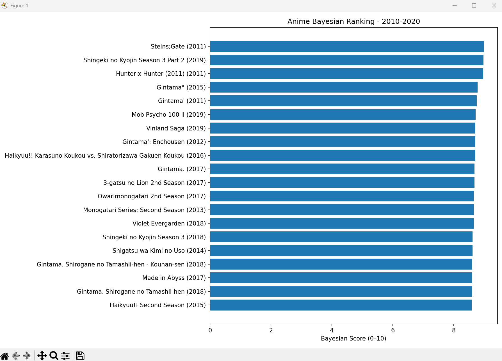
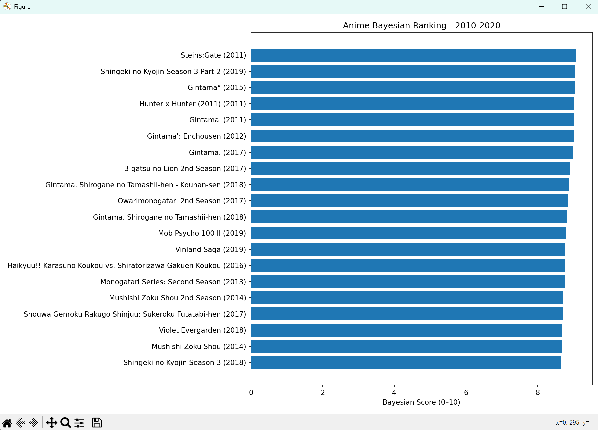
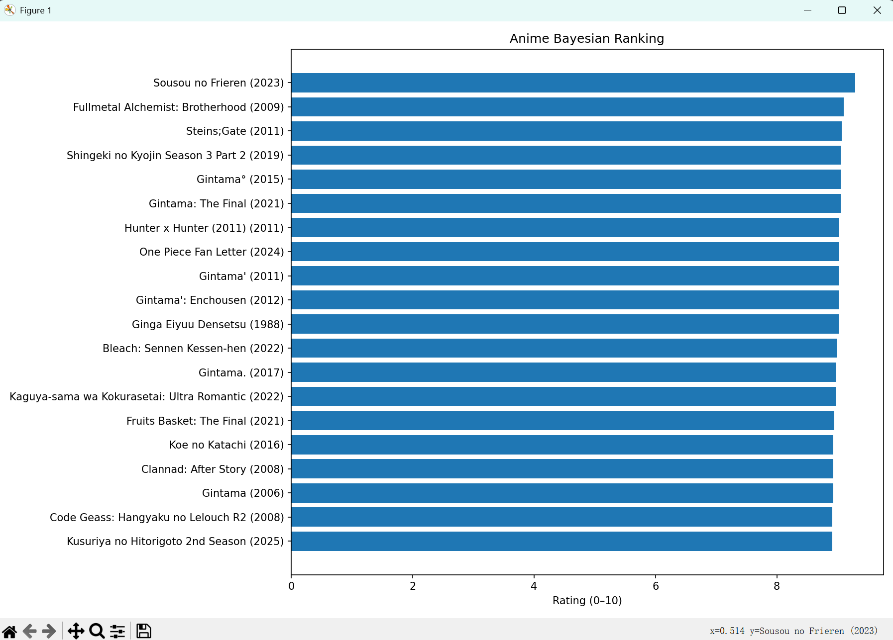
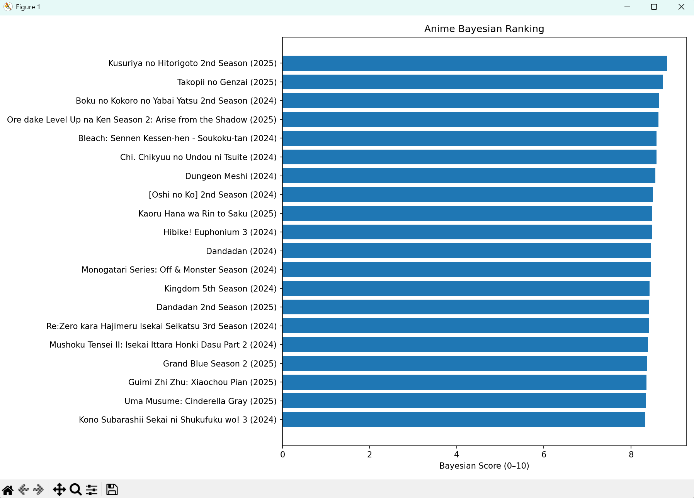
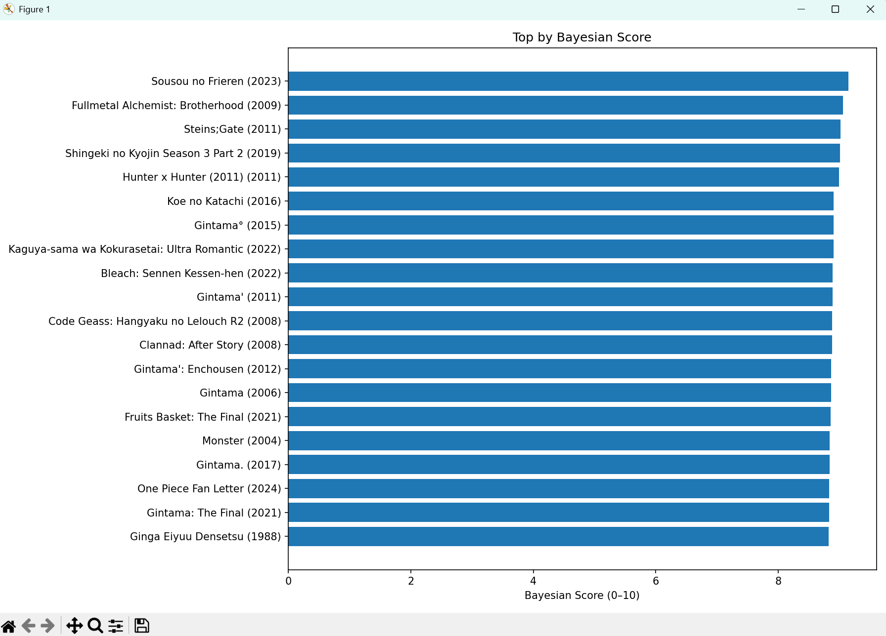

# AnimeAnalyst


**Explore anime data with statistically robust rankings.**  
AnimeAnalyst pulls titles from **MyAnimeList (Jikan v4)**, can cross-check **AniList**, lets you filter by time/type/genre, and plots top-K charts using a **Bayesian score** with a tunable prior (α).  
It’s a lightweight, reproducible tool for data-minded anime fans, students, and creators.


---

## Overview

**Why this project?**  
Public scores are noisy—small shows can look “too good,” big shows are penalized by variance.  
AnimeAnalyst applies **Bayesian shrinkage** to stabilize rankings, exposes the **α (prior strength)**, and keeps a **CSV cache** so you can iterate without hammering APIs.

**How it works (30s):**

1. Fetch from Jikan (`/anime`) with server-side filters.
2. Flatten results → **CSV cache**.
3. *(Optional)* Pull AniList and map MAL↔AniList.
4. Apply local filters (type/status/year/votes/genres).
5. Compute **Bayesian score**:  \(\frac{n}{n+m}\bar{s} + \frac{m}{n+m}C\).
6. Plot clean **horizontal bar charts**.

---

## Features

- 🔎 Jikan v4 fetch with filters: `q`, `type`, `status`, `min_score`, date range, `sfw`, pagination.
- 🧹 Local filters: type, status, year range, minimum voters, **genres (any/all)** by **name**.
- 🎭 **Genre helper**: `genre_all` to list all MAL genres; `genre_any <names|ids>` accepts names **or** numeric IDs.
- 🧮 **Bayesian score** using MAL `score` + `scored_by` with a robust prior (default `max(1000, median_votes)`).
- 📊 Matplotlib horizontal bar charts for the top-K titles.
- 💾 CSV cache (default `data/anime_cache.csv`) to avoid refetching.
- 🔌 Hooks to merge **AniList** data and compute a fused score.

---

## Install

```bash
# Python 3.10+ recommended
pip install -r requirements.txt

## Run

From the project root:

```bash
python -m anime_analyst.cli
```

This starts an **interactive shell**. Type parameters line by line, then `start` to run.

---

## Interactive commands

General:

* `help` – show all parameters and examples
* `show` – print current parameter values
* `reset` – reset to defaults
* `quit` / `exit` – leave the program

Genre helpers:

* `genre_all` – list all MAL anime genres as `id : name`
* `genre_any <tokens>` – set “match any” genres. `tokens` can be **names or IDs**, separated by space or comma

  * `genre_any Action, Fantasy`
  * `genre_any 1 10`

Booleans toggle if value omitted:

* `sfw` → toggles True/False
* `no_fetch` → toggles True/False

Finally:

* `start` – fetch (unless `no_fetch`), filter, score, and plot

---

## Parameters (what you can type)

| Key              | Type       | Choices                               | Default                | Description                                               |
| ---------------- | ---------- | ------------------------------------- | ---------------------- | --------------------------------------------------------- |
| `q`              | str        | –                                     | `""`                   | Title keyword (server-side search)                        |
| `type`           | str        | `tv, movie, ova, special, ona, music` | `""`                   | MAL type filter                                           |
| `status`         | str        | `airing, complete, upcoming`          | `""`                   | MAL airing status                                         |
| `year_from`      | int        | –                                     | –                      | Start year (inclusive)                                    |
| `year_to`        | int        | –                                     | –                      | End year (inclusive)                                      |
| `min_score`      | float      | 0–10                                  | –                      | Server-side min score                                     |
| `min_scored_by`  | int        | –                                     | –                      | Local min voters (`scored_by`)                            |
| `any_genres`     | list\[str] | –                                     | –                      | Local: include if matches **any** of these genres (names) |
| `all_genres`     | list\[str] | –                                     | –                      | Local: must match **all** these genres (names)            |
| `limit_per_page` | int        | 1–25                                  | `25`                   | Jikan page size                                           |
| `max_pages`      | int        | –                                     | `5`                    | Max pages to pull per run                                 |
| `sfw`            | bool       | –                                     | `False`                | Jikan `sfw` flag (filters R+/Rx)                          |
| `no_fetch`       | bool       | –                                     | `False`                | If True, **skip fetching** and only read local CSV        |
| `csv`            | str        | –                                     | `data/anime_cache.csv` | Cache file path                                           |
| `prior_m`        | float      | –                                     | –                      | Bayesian prior weight `m` (auto if not set)               |
| `topk`           | int        | –                                     | `20`                   | Number of bars in the chart                               |

> Any param can be given as `key value` or `key=value`. Repeating a key overwrites the previous value.

---

## Example sessions

Top TV airing now, at least 50k votes, any of Action/Adventure:

```
genre_all                     # see all available genres (id : name)
genre_any Action, Adventure   # or: genre_any 1 2 (ids also OK)
type tv
status airing
min_scored_by 50000
max_pages 3
start
```

Best movies 2010–2020 with SFW only:

```
type movie
year_from 2010
year_to 2020
min_scored_by 10000
sfw
start
```

Reuse cached CSV only (no network):

```
no_fetch
start
```

---

## How scoring works

Bayesian score:

$$
\text{score} = \frac{n}{n+m}\,\bar{s} + \frac{m}{n+m}\,C
$$

* $\bar{s}$: MAL mean score
* $n$: MAL `scored_by`
* $C$: global prior (vote-weighted average across filtered rows)
* $m$: prior weight

  * default: `m = max(1000, median(scored_by))`
  * override with `prior_m`

**Shrinkage intuition:** the effective “alpha” is $\alpha = \frac{m}{n+m}$. Larger $m$ ⇒ stronger pull toward $C$.

---

## Data sources

* **MAL via Jikan v4**

  * Endpoint: `https://api.jikan.moe/v4/anime`
  * Server-side params we use: `q`, `type`, `status`, `start_date`, `end_date`, `min_score`, `sfw`, `page`, `limit`
  * We respect HTTP `429` and `Retry-After`.

* **AniList (optional)**

  * `anime_analyst/clients/anilist.py` includes a GraphQL client (ID/title search).
  * `anime_analyst/core/merge.py` shows how to map MAL ↔ AniList and (optionally) compute a **fused score**.

> Genres are resolved via `https://api.jikan.moe/v4/genres/anime`. The CLI command `genre_all` lists them; `genre_any` accepts **names or IDs** (we convert IDs → names for local filtering).

---

## Gallery

> The following sample figures live in the repo under `assets/` as `p1.png … p5.png`.
> **p1** and **p2** use the **same time window** but different Bayesian priors (hence different effective **α** / shrinkage).

### p1 — 2010–2020, Bayesian Ranking (baseline prior)



### p2 — 2010–2020, Bayesian Ranking (stronger prior → higher α, more shrinkage)



### p3 — Top by Bayesian Score (broad/all-time)



### p4 — Recent Seasons, Bayesian Ranking (example)



### p5 — Non-Bayesian Rating chart (pure mean, no shrinkage)



---

## Project layout

```
src/
  anime_analyst/
    cli.py                   # interactive CLI (entry point)
    clients/
      jikan.py               # Jikan fetch + flatten
      anilist.py             # AniList GraphQL client (optional enrichment)
    core/
      filter.py              # local filters (type/status/year/votes/genres)
      scoring.py             # bayesian_score + compute_bayesian_scores
      plotting.py            # plot_hbar_top
      merge.py               # MAL↔AniList merge + fusion logic (optional)
    data/
      genre.py               # GenreResolver (name/id mapping, genre_all/any)
      io.py                  # CSV save/load
assets/
  p1.png p2.png p3.png p4.png p5.png
```

Run as a module:

```bash
python -m anime_analyst.cli
```

---

## Requirements

`requirements.txt`:

```
requests>=2.31,<3
matplotlib>=3.8,<3.10
numpy>=1.24,<3
# rich>=13.7   # (optional) pretty CLI tables
```

Install:

```bash
pip install -r requirements.txt
```

---

## Caching

* By default, fetched rows are flattened and saved to `data/anime_cache.csv`.
* Set `no_fetch` to reuse the CSV without network calls.

---

## Troubleshooting

* **`No module named 'anime_analyst'`**
  Run from the **project root** with module mode:

  ```bash
  python -m anime_analyst.cli
  ```

  Or mark `src/` as Sources Root / set `PYTHONPATH` to the project root.

* **HTTP 429**
  We back off using `Retry-After` and a small delay. Lower `max_pages` / `limit_per_page` if needed.

* **IDE files keep conflicting**
  Ensure `.gitignore` contains:

  ```
  .idea/
  __pycache__/
  *.pyc
  .venv/
  data/*.csv
  ```

  And remove tracked IDE files:

  ```bash
  git rm -r --cached .idea
  ```

---

## License

MIT

```
::contentReference[oaicite:0]{index=0}
```
